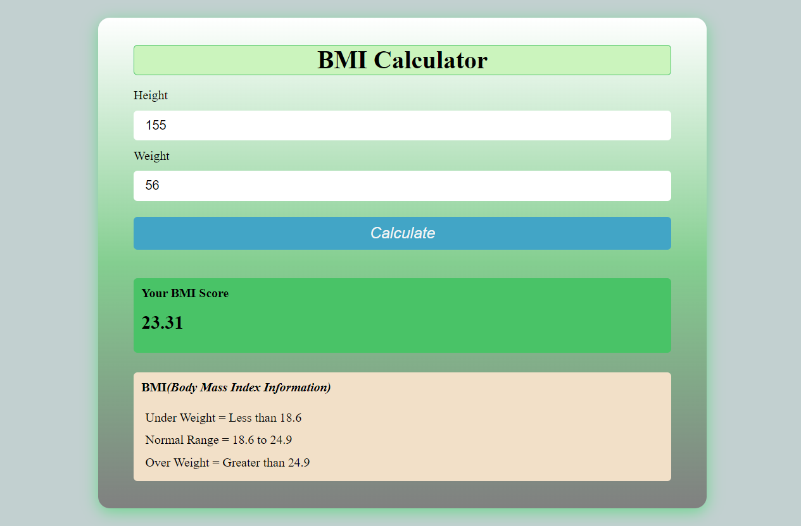

# BMI Calculator

A simple yet interactive BMI (Body Mass Index) calculator built with JavaScript, HTML, and CSS to determine the BMI of users based on their weight and height. This project is ideal for beginners and serves as a practical example of basic JavaScript logic.

## Project Overview
The BMI Calculator allows users to input their weight and height to calculate their Body Mass Index (BMI), which helps assess whether they are underweight, normal weight, overweight, or obese. BMI is a useful metric for health and fitness purposes. The app categorizes the result based on the calculated BMI, providing feedback on the user's weight status.

## Features
- **Simple User Interface:** Easy to use, with input fields for height and weight.
- **BMI Calculation:** Automatically calculates BMI when inputs are provided.
- **Categorization:** Provides feedback on the BMI category (Underweight, Normal, Overweight, Obese).
- **Responsive Design:** Works well on mobile, tablet, and desktop devices.

## How to Use
1. **Input your weight** (in kilograms or pounds) in the weight input field.
2. **Input your height** (in centimeters or feet/inches) in the height input field.
3. **Click on the "Calculate" button** to view the result.
4. Your BMI value will be displayed, along with the corresponding category (Underweight, Normal, Overweight, Obese).

### Example:
- **Weight:** 70 kg
- **Height:** 175 cm
- **Result:** BMI = 22.86 (Normal)

## Live Demo
You can try the live version of the BMI calculator here: [Live Demo](your-github-pages-link).

## Screenshots



## Technologies Used
- **HTML5:** For structuring the content and layout of the app.
- **CSS3:** For styling the app and making it responsive.
- **JavaScript (ES6):** For implementing the logic of BMI calculation and dynamically updating the result.

## Installation
To run the project locally:

1. Clone the repository:
   ```bash
   git clone https://github.com/your-username/bmi-calculator.git
